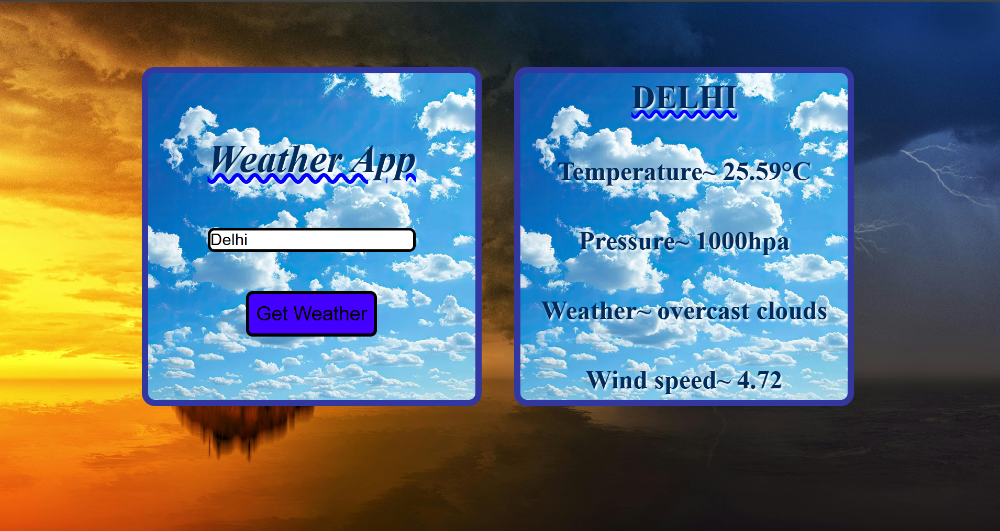

# Weather App
A simple weather app built using HTML, CSS, and JavaScript. It fetches real-time weather data for any city using the OpenWeatherMap API.

🔧 Features~
- Search weather by city name.  
- Displays temperature,pressure,weather and wind speed.
- Handles error. 
- Beautiful background image.

🛠 Tech Stack~
- HTML  
- CSS  
- JavaScript (Fetch API)  
- OpenWeatherMap API

🖼 Screenshot~

🚀 How to Run~
1. Clone or download the repo.
2. Open index.html in your browser.
3. Enter a city name and click "Search" to view the weather.

📌 Status
✅ Completed – Basic weather search functionality implemented.

